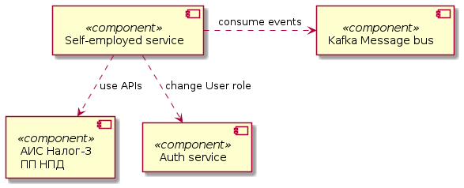
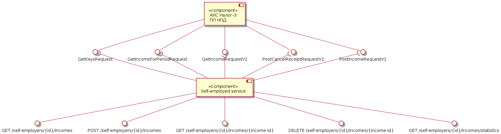
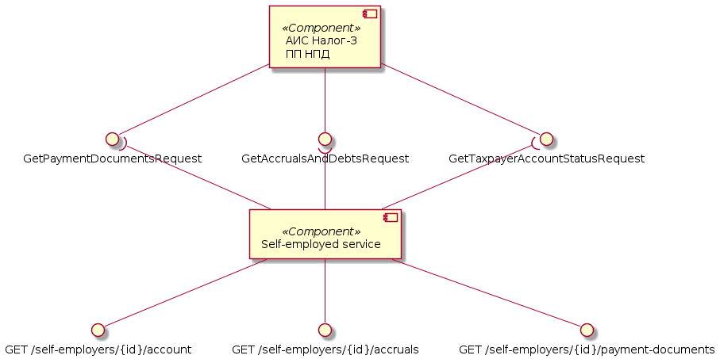
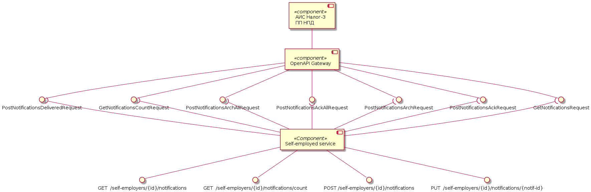
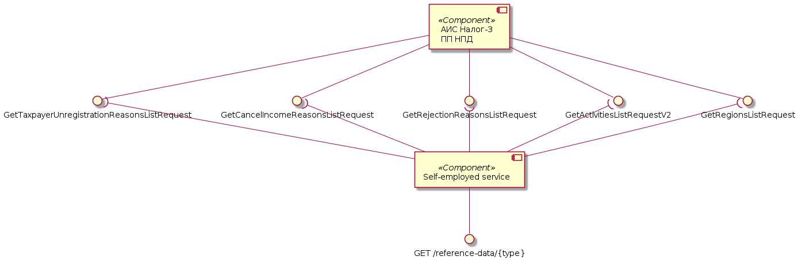
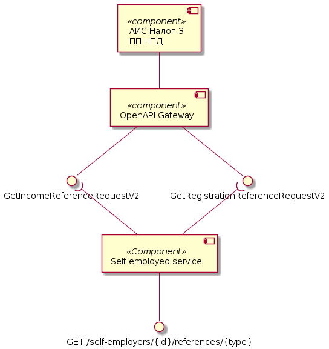
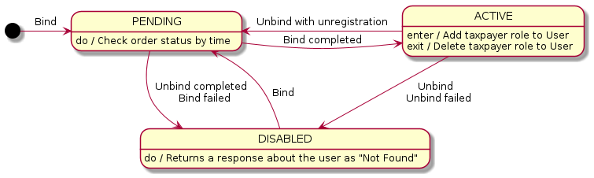

# Архитектурное решение сервиса самозанятых

## Оглавление

- [Архитектурное решение сервиса самозанятых](#архитектурное-решение-сервиса-самозанятых)
  - [Оглавление](#оглавление)
  - [Глоссарий](#глоссарий)
  - [Основание](#основание)
    - [Проблематика](#проблематика)
    - [Цель](#цель)
    - [Аннотация](#аннотация)
  - [Компонентная модель решения](#компонентная-модель-решения)
    - [Высокоуровневая модель](#высокоуровневая-модель)
    - [Операции с налогоплательщиком](#операции-с-налогоплательщиком)
    - [Операции с доходом](#операции-с-доходом)
    - [Операции со счётом](#операции-со-счётом)
    - [Операции с уведомлениями](#операции-с-уведомлениями)
    - [Операции со словорями](#операции-со-словорями)
    - [Операции со справками](#операции-со-справками)
  - [Диаграмма состояний](#диаграмма-состояний)
    - [Состояния Self-employer](#состояния-self-employer)
    - [Состояния Order](#состояния-order)

## Глоссарий

- Автоматизированная информационная система (АИС)

- Федеральная налоговая служба (ФНС)

- Налог-3 - название АИС для предоставления услуг ФНС через цифровые каналы связи.

- Самозанятый (Налогоплательщик, НП) - физическое лицо или индивидуальный предприниматель использующий "Налог на профессиональный доход".

- Налог на профессиональный доход (НПД) - новый специальный налоговый режим для самозанятых граждан, который можно применять с 2019 года. Действовать этот режим будет в течение 10 лет.

## Основание

### Проблематика

Потребность клиентов банка регистрировать свои доходы в ФНС через приложение банка.

### Цель

Предоставление сервисов АИС ФНС для самозанятых через REST API.

### Аннотация

1. При каждой авторизации происходит проверка пользователя на актуальность его статуса в системе ИБ.
2. ИНН налогоплательщика является id ресурса в коллекции `self-employers`.
3. Для регистрации пользователя в ФНС как самозанято формируется запрос с `XMLDSig` используя УКЭП.
4. Все справочники ФНС хранятся в базе интернет банка и обновляются раз в сутки.
5. Сущность `Self-employer` либо отсутствует в системе или может находится в одном из трех состояний: `Active`, `Disabled`, `Pending`.
6. В зависимости от текущего статуса `Self-employer` у сущности `User` либо появляется роль `taxpayer` либо удаляется.

## Компонентная модель решения

### Высокоуровневая модель

### Операции с налогоплательщиком

### Операции с доходом

### Операции со счётом

### Операции с уведомлениями

### Операции со словорями

### Операции со справками

## Диаграмма состояний

### Состояния Self-employer

### Состояния Order

[order-state.png](../../assets/images/diagrams/self-employed-service/state/order-state.png)

В некоторых Заявках ФНС может вернуть статусы которые сопоставляются следующим образом:

* `ACCEPTED` = `COMPLETED`
* `APPLIED` = `COMPLETED`
* `REJECTED` = `FAILED`
* `DENIED` = `FAILED`
