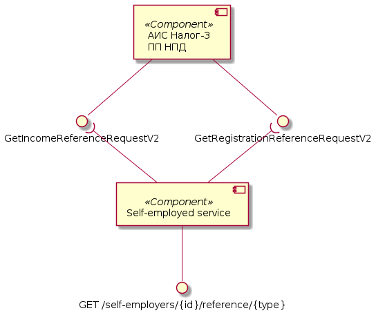

# Архитектурное решение сервиса самозанятых

## Глоссарий

- Автоматизированная информационная система (АИС)

- Федеральная налоговая служба (ФНС)

- Налог-3 - название АИС для предоставления услуг ФНС через цифровые каналы связи.

- Самозанятый (Налогоплательщик, НП) - физическое лицо или индивидуальный предприниматель использующий "Налог на профессиональный доход".

- Налог на профессиональный доход (НПД) - новый специальный налоговый режим для самозанятых граждан, который можно применять с 2019 года. Действовать этот режим будет в течение 10 лет.

## Основание

### Проблематика

Потребность клиентов банка применяющих НПД использовать сервисы ФНС через приложение банка.

### Цель
Предоставление сервисов АИС ФНС для самозанятых через REST API.

### Аннотация

1. При каждой авторизации происходит проверка пользователя на актуальность его статуса в системе ИБ.
2. ИНН налогоплательщика является id ресурса в коллекции `self-employers`.

## Компонентная модель решения

### Операции с налогоплательщиком

### Операции с доходом

### Операции со счётом

### Операции с уведомлениями

### Операции со словорями

### Операции со справками
