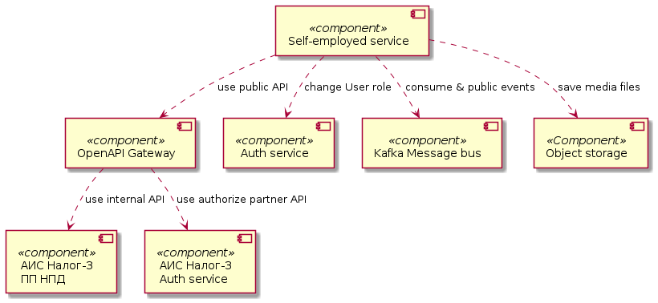
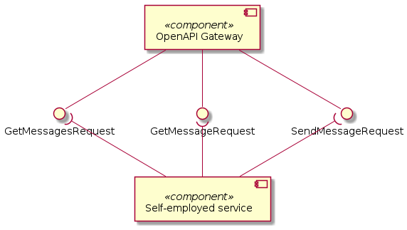
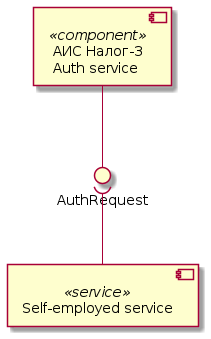
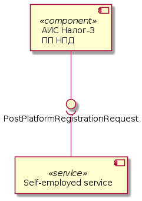
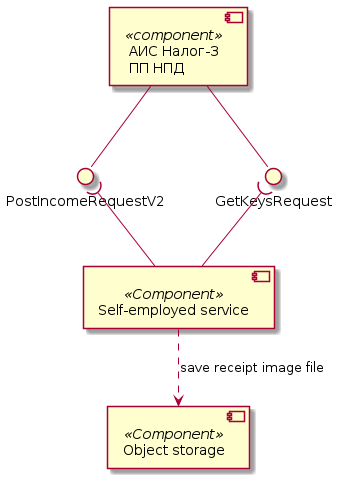
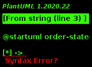
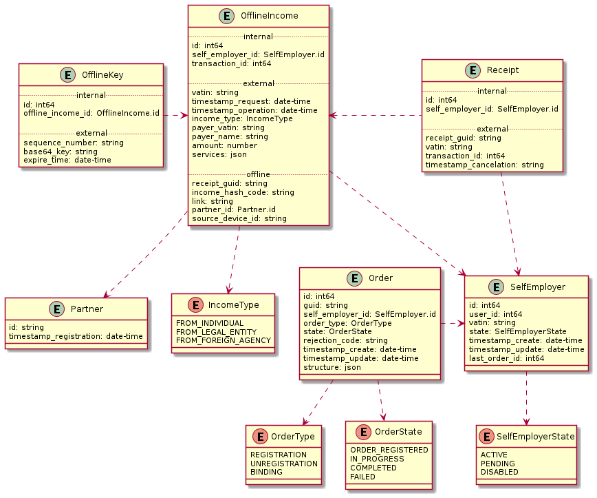

# Архитектурное решение сервиса самозанятых

## Глоссарий

- Автоматизированная информационная система (АИС)
- Федеральная налоговая служба (ФНС)
- Налог-3 - название АИС для предоставления услуг ФНС через цифровые каналы связи.
- Самозанятый (Налогоплательщик, НП) - физическое лицо или индивидуальный предприниматель использующий "Налог на профессиональный доход".
- Налог на профессиональный доход (НПД) - новый специальный налоговый режим для самозанятых граждан, который можно применять с 2019 года. Действовать этот режим будет в течение 10 лет.
- Партёнр - Банкс "Санкт Петербург" предоставляющий сервисы НПД Налог-3 для пользователей Интернет банка.
- OpenAPI (Открытые API) -  API шлюз для взаимодействия с публичными API АИС Налог-3.

## Основание

### Проблематика

Потребность клиентов банка регистрировать свои доходы в ФНС через приложение банка.

### Цель

Предоставление сервисов АИС ФНС для самозанятых через REST API.

### Аннотация

1. При каждой авторизации происходит проверка пользователя на актуальность его статуса в системе ИБ.
2. ИНН налогоплательщика является id ресурса в коллекции `self-employers`.
3. Для регистрации пользователя в ФНС как самозанято формируется запрос с `XMLDSig` используя УКЭП банка.
4. Всё взаимодействие с Автоматизированной Информационной Системой ФНС происходит через API шлюз "OpenAPI".
5. Для аутентификации Партёнра используется сервис Аутентификации ФНС по ключу Партнёра. Необходимо для последующей авторизации запросов в "OpenAPI".
6. Все справочники ФНС хранятся в базе интернет банка и обновляются раз в сутки.
7. Сущность `Self-employer` либо отсутствует в системе или может находится в одном из трех состояний: `Active`, `Disabled`, `Pending`.
8. В зависимости от текущего статуса `Self-employer` у сущности `User` либо появляется роль `self-employer` либо удаляется.
9. В случаи когда сервер ФНС OpenAPI не отвечает регистрация дохода должна происходить в `Self-employer service`.
10. Для регистрации дохода `Self-employer service` загружает и хранит ключи из ФНС, обновляя ключи за два дня до даты истечения.
11. Все необходимые данные Offline чека, включая визуальное представление чека, генерируются и хранятся в `Self-employer service` пока не будут переданы в ФНС.

## Компонентная модель решения

### Высокоуровневая модель

### Отправка сообщений на шлюз ФНС "Open API"

### Аутентификация партнёра

### Регистрация партнёра

### Операции с налогоплательщиком

### Операции с доходом

### Операции для Offline регистрации дохода

При попытке регистрации дохода в ФНС может быть потерянно соединение с ФНС и сервера могут не отвечать.
Поэтому все доходы сохраняются в хранилище (таблица или очередь) в котором находятся до момента регистрации в ФНС.
В случаи недоступности сервера ФНС `Self-employer service` формирует следующий набор атрибутов сам:

- income_hash_code: фискальный признак чека генерирующийся по алгоритму хеширования из следующих атрибутов:
  - base64_key: ключ полученный из ФНС методом `GetKeysRequest`;
  - vatin: ИНН самозанятого;
  - timestamp_request: дата формирования запроса;
  - timestamp_operation: дата расчёта дохода;
  - payer_vatin: ИНН покупателя;
  - amount: сумма дохода в чеке;
  - partner_id: id присвоенный банку при регистрации;
  - source_device_id: всегда `0` так как взаимодействие с ФНС происходит через сервис банка, а не мобильное приложение.
- receipt_guid: 10 значный id квитанции в налоговой. Для формирования используется конкатенация значения двух аттрибутов `{sequence_number}`+`{income_hash_code}`:
  - sequence_number: инкрементная часть чека из 4 знаков, полученная методом `GetKeysRequest`;
  - income_hash_code: атрибут генерируемый сервисов, составляет последние 6 знаков в id чека.
- link: ссылка сформированная из первых двух параметров по схеме: `{host}/api/v1/receipt/{vatin}/{income_hash_code}/print`.

На основании полученных атрибутов формируется визуальное представление квитанции в виде png или pdf файлы, в который добавляется QR код содержащий сгенерированный `{link}`.
Визуальное представление хранится в сервисе месяц после выгрузки Offline чеков в ФНС.

После возобновления работы сервера ФНС все Offline чеки передаются в ФНС и очищаются из хранилища (таблицы или очереди).

### Операции со счётом

### Операции с уведомлениями

### Операции со справочниками

### Операции со справками

## Диаграмма состояний

### Состояния Self-employer

### Состояния Order

В некоторых Заявках ФНС может вернуть статусы которые сопоставляются следующим образом:

* `ACCEPTED` = `COMPLETED`
* `APPLIED` = `COMPLETED`
* `REJECTED` = `FAILED`
* `DENIED` = `FAILED`

## Схема хранения данных

